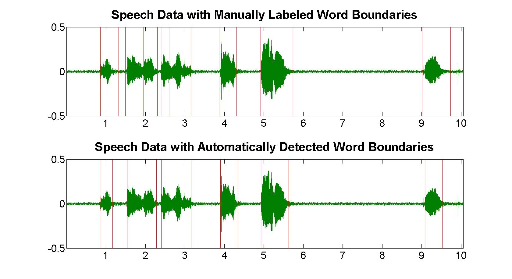
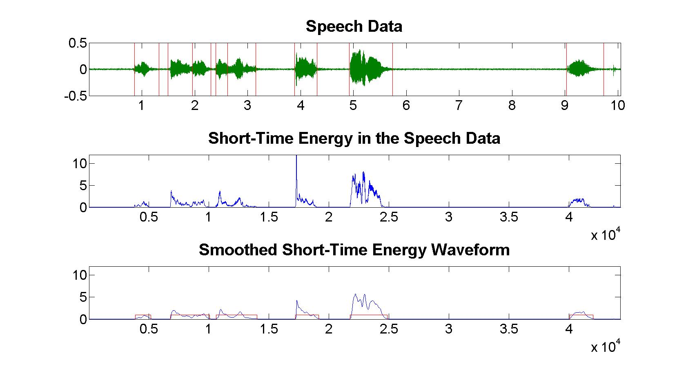

# Automatic Word Boundary Detection in a Speech Utterance using Adaptive Scaling

Word boundary detection is a necessary preprocessing step for automatic speech recognition, and several studies have shown that the accuracy of word boundary detection directly affects the accuracy of speech recognition.  
Almost every study conducted here involves the collection of a large number of recorded sentences. The sentences are then segmented by marking the start and end of each word. This is done by trained individuals in the lab, and their work is compared to each others' to establish a measure of inter-labeler reliability. The recordings are typically high quality and low noise.
## The code generates the following relevant plots.
### Manually/Automatically Detected Word Boundaries

### Layered Extraction of the Word Boundaries

Please refer to the **ResultsReport.pdf** for details on the implementation.

The csv file **duration** (an example file is included) generated by `getAllDuration.py` code over a speech corpora's textgrid samples contains the duration (***d_w*** in seconds) of all words in the utterances.

### Future Work:

* With ***d_w*** information for all words, we can then construct a simplified probability density function for each word, ***p_w***. 
* The word boundaries detected by `Detect_WordBoundary.m` can be adaptively scaled and thereby improved using ***p_w***.  

